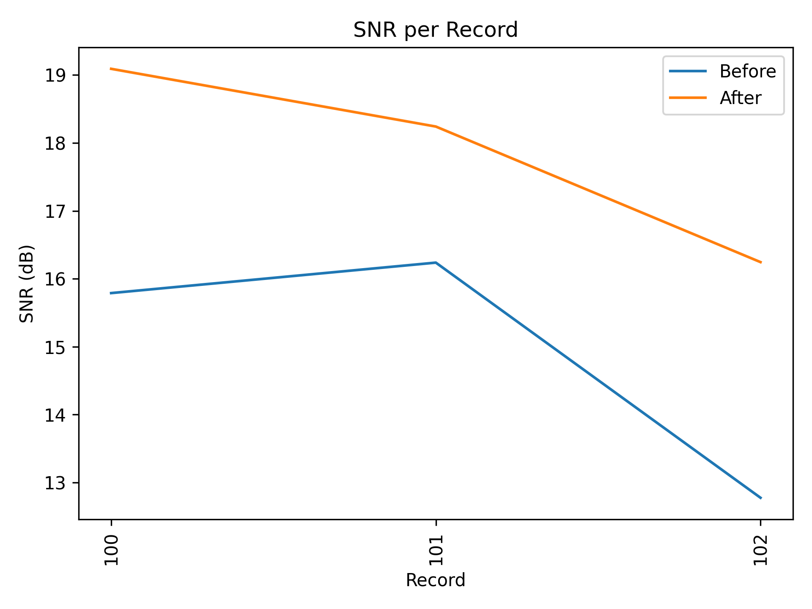
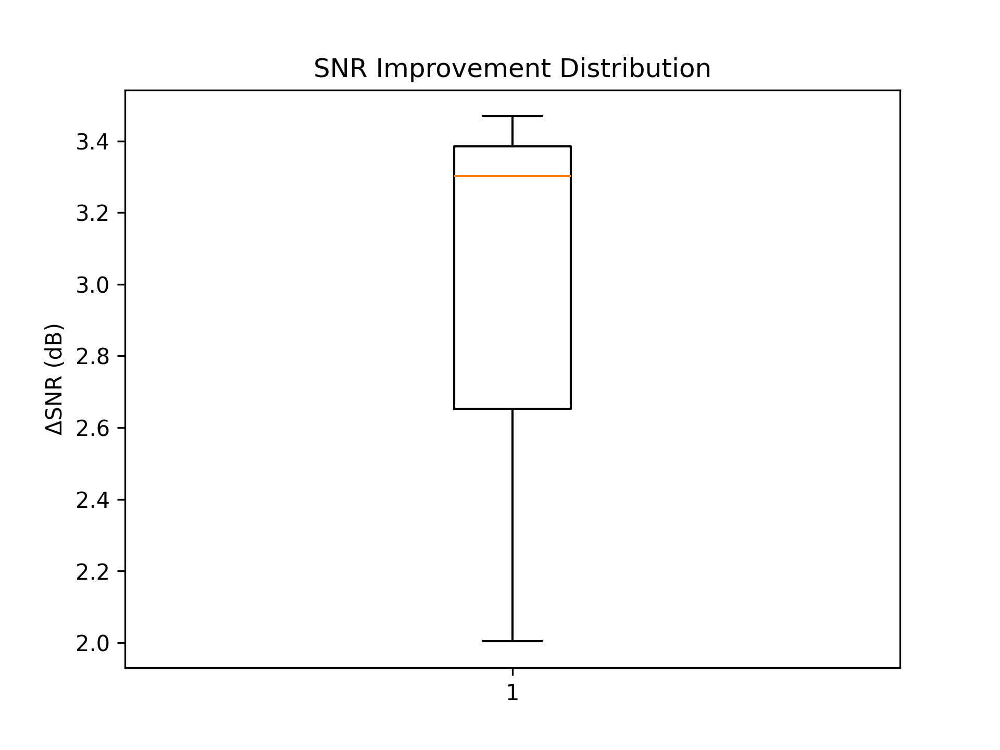
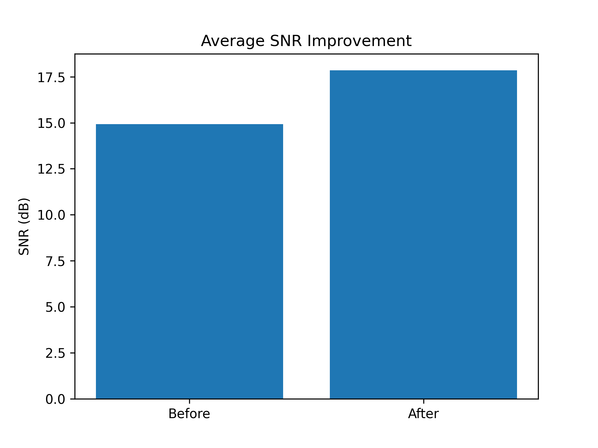
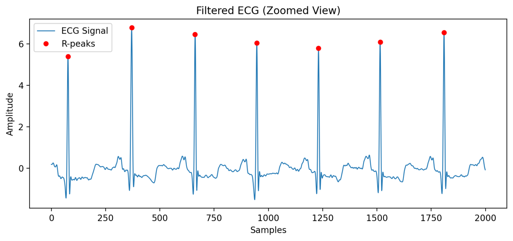
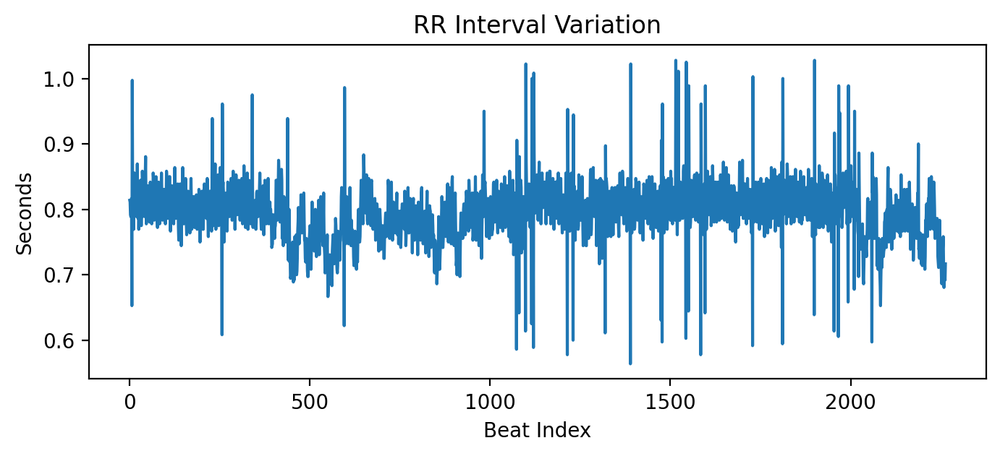
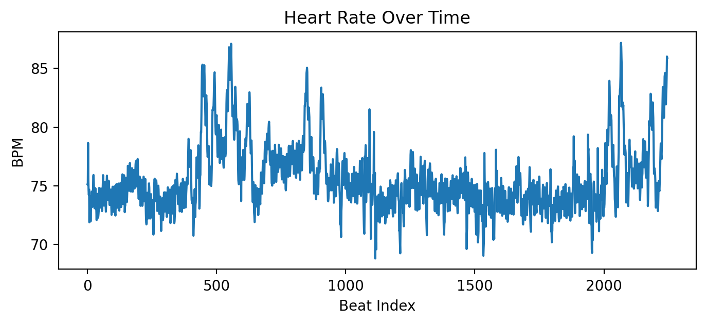

# ❤️ Intelligent ECG System

An adaptive ECG signal processing system for **noise reduction, signal enhancement, and real-time physiological analysis** using frequency-domain techniques.

---

## 🚀 Live Demo
🔗 https://6cmukok4vrrxpuz6frhvdy.streamlit.app/

---

## 🧠 Key Features
- Adaptive ECG denoising using PSD-based filtering
- Automatic noise detection (baseline wander & powerline)
- Real-time signal processing
- R-peak detection (physiological)
- Heart Rate (HR) & HRV computation
- Signal Quality Index (SQI)
- MIT-BIH dataset integration
- CSV upload support

---

## 📊 Results

### 🔹 Average SNR Improvement


✔ Improved from **15.79 dB → 19.09 dB**

---

### 🔹 SNR per Record


---

### 🔹 SNR Distribution


---

### 🔹 ECG Signal with R-Peaks


---

### 🔹 RR Interval Variation


---

### 🔹 Heart Rate Over Time


---

## 📈 Metrics
| Metric | Description |
|------|------------|
| SNR | Signal-to-Noise Ratio |
| SQI | Signal Quality Index |
| HR | Heart Rate (BPM) |
| HRV | Heart Rate Variability |
| Confidence | Signal reliability |

---

## 🗂 Dataset
- MIT-BIH Arrhythmia Database  
- Records used: **100, 101, 102**

---

## ⚙️ Tech Stack
- Python
- Streamlit
- NumPy / SciPy
- Matplotlib
- WFDB

---

## ▶️ Run Locally

```bash
pip install -r requirements.txt
streamlit run app.py

☁️ Deployment

Deployed using Streamlit Cloud


📄 Research Contribution

This project introduces a data-driven adaptive filtering pipeline that dynamically identifies noise characteristics and applies appropriate filtering strategies, improving ECG signal quality without distorting physiological features.

👨‍💻 Author
Aanya Chandrakar

📬 Contact

📧 aanya25100@iiitnr.edu.in
